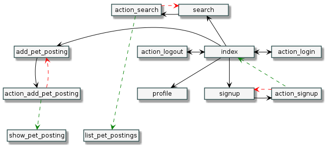
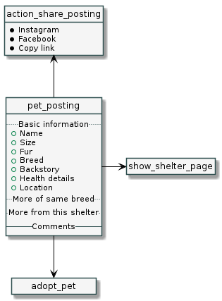
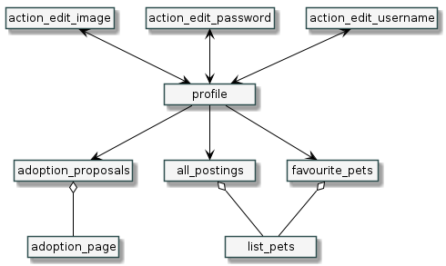

# Hoaloha

[Check it out here!](https://web.fe.up.pt/~up201806330/ltw-project-g50/)

- **Project name:** Hoaloha
- **Short description:** Pet adoption website
- **Tools:** PHP, HTML, Javascript, CSS, Ajax
- **Institution:** [FEUP](https://sigarra.up.pt/feup/en/web_page.Inicial)
- **Course:** [LTW](https://sigarra.up.pt/feup/en/ucurr_geral.ficha_uc_view?pv_ocorrencia_id=281471) (Web Languages and Technologies)
- **Project grade:** 17.5/20.0
- **Group members:**
    - [Diogo Henrique Pinto de Almeida](https://github.com/diogohalmeida) ([up201806630@fe.up.pt](mailto:up201806630@fe.up.pt))
    - [João António Cardoso Vieira e Basto de Sousa](https://github.com/JoaoASousa) ([up201806613@fe.up.pt](mailto:up201806613@fe.up.pt))
    - [Pedro Manuel Santos Queirós](https://github.com/pedroqtuga) ([up201806329@fe.up.pt](mailto:up201806329@fe.up.pt))
    - [Rafael Soares Ribeiro](https://github.com/up201806330) ([up201806330@fe.up.pt](mailto:up201806330@fe.up.pt))

## Credentials (username/password (role))
All created accounts have the same role (possible owner and adopter) and password (**12345678**)
 - curriewilliam14
 - JeffSDuffy22
 - brownrita321
 - lafontaine34

## Libraries:
 - FontAwesome (for the 'heart' button) (https://fontawesome.com/)
 - Google Material Design Icons (for icons throughout the whole page) (https://material.io/resources/icons/)

## Features:
 - Security
     - **XSS:** yes
     - **CSRF:** yes
     - **SQL using prepare/execute:** yes
     - **Passwords:** php's *password_hash* and *password_verify*
     - **Data Validation:** regex, php and html
 - Technologies
     - **Separated logic/database/presentation:** yes
     - **Semantic HTML tags:** yes
     - **Responsive CSS:** yes
     - **Javascript:** yes
     - **Ajax:** yes (creation / deletion of questions and answers)
     - **REST API:** no
  - Usability:
     - **Error/success messages** 
     - **Creation and deletion of questions and answers in pet's postings**
     - **Registering of new accounts (with username, password, photo and other fields)**
     - **Login and logout of an account**
     - **Editing of own profile**
     - **Creation of pet's adoption page (with name, breed, gender and other fields)**
     - **Possibility to add multiple photos to a pet's page**
     - **Editing of a pet's page**
     - **Deleting of a pet's page**
     - **Searching of pets by certain fields (weight, age, breed and other parameters)**
     - **Listing of sent and received adoption proposals in specific page**
     - **Creation of adoption proposals on a pet (with the ability to rename them)**
     - **Acception or refusal of received proposals**
     - **Addition and removal of a pet from a favourites list**
     - **Listing of added, adopted and favourited pets in a user's profile**
     - **Insertion of new photos by the new owner after an adoption**
 
## Navigation

## Database
[hoaloha.sql](database/hoaloha.sql)
